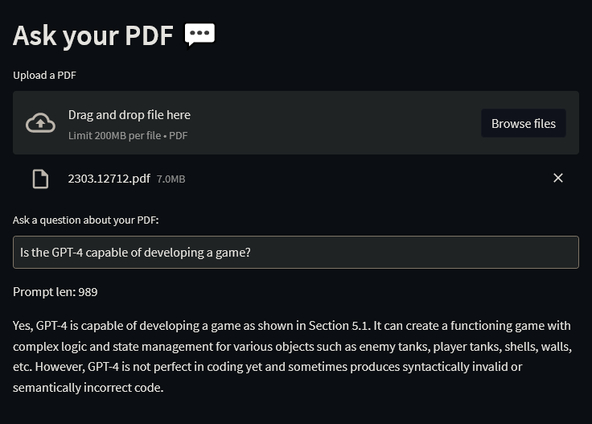

# Ask Your PDF, locally

|  |
|:--:|
| Answering question about [2303.12712 paper](https://arxiv.org/pdf/2303.12712.pdf) 7mb pdf file |

This is an attempt to recreate [Alejandro AO's langchain-ask-pdf](https://github.com/alejandro-ao/langchain-ask-pdf) using open source models running locally.

It uses [all-MiniLM-L6-v2](https://huggingface.co/sentence-transformers/all-MiniLM-L6-v2) instead of OpenAI Embeddings, and [StableVicuna-13B](https://huggingface.co/CarperAI/stable-vicuna-13b-delta) instead of OpenAI models.

It runs on the CPU, is impractically slow and was created more as an experiment, but I am still fairly happy with the results.

## Requirements
GPU is not used and is not required.

You can squeeze it into 16 GB of RAM, but I recommend 24 GB or more.

## Installation

- Install requirements (preferably to `venv`): `pip install -r requirements.txt`

- Download `stable-vicuna-13B.ggml.q4_2.bin` from [TheBloke/stable-vicuna-13B-GGML](https://huggingface.co/TheBloke/stable-vicuna-13B-GGML/tree/main) and place it in project folder.

## Usage

Run `streamlit run .\app.py`
This should launch the UI in your default browser. Select a PDF file, send the question, wait patiently.